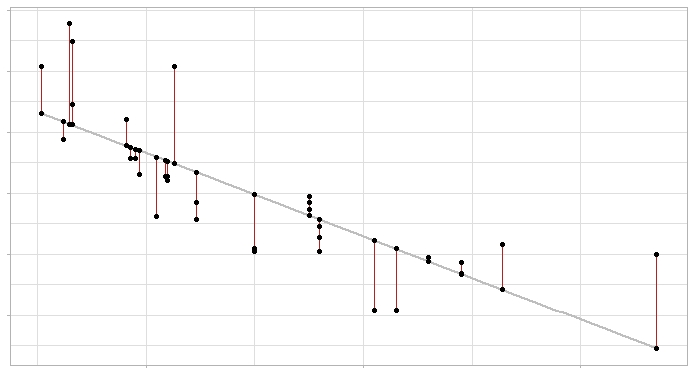

>Este recorrido se basa en el material Joaquín Amat Rodrigo [Regresión lineal con Python](https://www.cienciadedatos.net/documentos/py10-regresion-lineal-python.html)

### Introducción a la Ciencia de Datos con Python

Para este recorrido necesitarás las librerías [Pandas](https://pandas.pydata.org/), [Seaborn](https://seaborn.pydata.org/) y [Scipy](https://www.scipy.org/)


Podes corroborar si las tienes instaladas corriendo las siguientes líneas en tu intérprete de Python:

```python
import pandas as pd
import seaborn as sns
import scipy.stats as ss
```

Si correr estas lineas no tira ningún error, etonces están felizmente instaladas las bibliotecas enc uestión. De lo contrario, obtendremos un mensaje de error `ModuleNotFoundError: No module named` al correr las lineas anteriores. En tal caso, podés instalar las bibliotecas desde la consola, con el comando:

```bash
        pip install pandas
        pip install seaborn
        pip install scipy
```

# Guias de Trabajo
 * [1. De relaciones, etiquetas y otras yerbas](#1_intro)
 * [2. Regresión lineal](#2_regresion)
 * [3. Ajuste del modelo](#3_ajuste)
 * [4. Manos a los datos](#4_ejemplo)


[1. De relaciones, etiquetas y otras yerbas](#1_intro)

Hemos estado trabajando en [clustering o agrupamientos](https://github.com/AJVelezRueda/Fundamentos_de_informatica/blob/master/Ciencia_de_datos/Clustering.md), donde intentamos encontrar patrones en datos contínuos sin etiquetas. Como ya hemos visto, estos métodos nos permiten encontrar similitudes entre las observaciones de modo que podamos agruparlas según características en común y diferenciarlas de los otros grupos de observaciones. 

La clusterización es lo que denominamos un métdo de aprendizaje **no supervisado**; donde solo disponemos de un conjunto de datos no etiquetados de entrada, sobre los que debemos obtener información, sin conocer previamente cuál será la salida. 

Existen técnicas que nos permiten trabajar con datos etiquetados. Los algoritmos de **aprendizaje supervisado**, se utilizan para hacer predicciones. Existen dos tipos de algoritmos de predicción: los algoritmos de regresión y los de clasificación, cuya principal diferencia radica en que los algoritmos de regresión se utilizan para hacer predecciones sobre valores continuos, mientras que los algoritmos de clasificación se utilizan para predecir/clasificar los valores discretos.

Podemos resumir algunas de las diferencias más importantes entre estos algoritmos del siguiente modo:


| Regresión | Clasificación | 
|-------------	|----------	|
| la variable de salida debe ser de naturaleza continua o valor real |  la variable de salida debe ser un valor discreto | 
| La tarea del algoritmo de regresión es mapear el valor de entrada (x) con la variable de salida continua (y)| La tarea del algoritmo de clasificación es mapear el valor de entrada (x) con la variable de salida discreta (y) |
|   Un problema de regresión necesita la predicción de una cantidad | En un problema de clasificación, los datos se etiquetan en una de dos o más clases |
| En Regresión, intentamos encontrar la línea de mejor ajuste, que puede predecir la salida con mayor precisión |En Clasificación, intentamos encontrar el límite de decisión, que puede dividir el conjunto de datos en diferentes clases |

Según el problema a resolver y las característica de nuestros datos seleccionaremos el método más apropiado para su resolución.

[2. Regresión lineal](#2_regresion)

En este recorrido nos enfocaremos en predecir o estudiar las relaciones entre las variables. En particular, en un tipo de relación: lineal. Este método estadístico se usa para describir una variable continua como una función de una o varias variables independientes. 

Las técnicas de regresión lineal tratan de modelar la relación entre una variable continua y una o más variables independientes mediante el ajuste de una ecuación lineal.

Si bien, nuestra suposición basal es que muestros datos debrían caer sobre una recta que describe la relación entre nuestras variables, las observaciones no cumplen con esta idealidad. Cada valor se aparta de la "recta ideal" en un valor de error (ϵ). De ahí que la ecuación general correspondiente a un modelo de regresión lineal es:

``
Yi = β0 + ∑ βi.Xi + ϵi
``

Donde β0 se corresponde con la ordenada al origen (es decir, el valor de y cuando las demás variables son cero) y βi es el efecto promedio que tiene el cambio en Xi sobre la variable Y (cuando el resto de las variables es constante). Esto representa la pendiente de la recta.


[3. Ajuste del modelo](#3_ajuste)

Ajustar el modelo consiste en estimar, a partir de los datos disponibles:
- la recta que minimice la distancia entre mis datos y esta 
- encontrar los valores de los coeficientes de regresión que maximizan la probabilidad de que la recta prediga los valores observados.

El método  más utilizado para el ajuste del modelo lineal es el de mínimos cuadrados, que identifica como mejor modelo la recta (o plano si es regresión múltiple) que minimiza la suma de los cuadrados de los errores:

```python
ϵ2  = ∑ (yi - ŷi)2 
```

Es  decir,  la  suma  de  los  cuadrados  de  las  diferencias  entre  los  valores  reales  observados  (yi)  y los valores estimados (ŷi)



Como se ve en el gráfico, la línea gris representa la recta de regresión (el modelo) y los segmentos rojos el error entre esta y cada observación.

[4. Manos a los datos](#4_ejemplo)

Tomemos un ejemplo concreto. Supongamos que un analista de deportes quiere saber si existe una relación entre el número de veces que batean los jugadores de un equipo de béisbol y el número de runs que consigue; y en caso de existir, establecer un modelo que le permita predecir el resultado de partidos futuros:

```python
import pandas as pd
import numpy as np

import matplotlib.pyplot as plt
import seaborn as sns

equipos = ["Texas","Boston","Detroit","Kansas","St.","New_S.","New_Y.",
           "Milwaukee","Colorado","Houston","Baltimore","Los_An.","Chicago",
           "Cincinnati","Los_P.","Philadelphia","Chicago","Cleveland","Arizona",
           "Toronto","Minnesota","Florida","Pittsburgh","Oakland","Tampa",
           "Atlanta","Washington","San.F","San.I","Seattle"]
bateos = [5659,  5710, 5563, 5672, 5532, 5600, 5518, 5447, 5544, 5598,
          5585, 5436, 5549, 5612, 5513, 5579, 5502, 5509, 5421, 5559,
          5487, 5508, 5421, 5452, 5436, 5528, 5441, 5486, 5417, 5421]

runs = [855, 875, 787, 730, 762, 718, 867, 721, 735, 615, 708, 644, 654, 735,
        667, 713, 654, 704, 731, 743, 619, 625, 610, 645, 707, 641, 624, 570,
        593, 556]

datos = {'equipos': equipos, 'bateos': bateos, 'runs': runs}
```

> 🧗‍♀️ Desafío I: dado el diccionario con los datos de partidos anteriores crea un DataFrame de nombre `datos_partidos_previos`
>
> 🧗‍♀️ Desafío II: graficá el número de bateos vs el numero de runs, para observar la relación entre ambas variables 
> Para pensar 🤔: ¿Observas una tendencia en los datos?
>

<details>
  <summary>Pista</summary>
 sns.scatterplot(data=tips, x="bateos", y="runs")
</details>

Ahora veamos de forma numérica si existe la misma tendencia que se observa gráficamente:

```python
from scipy.stats import pearsonr

corr_test = pearsonr(x = datos['bateos'], y =  datos['runs'])
print("Coeficiente de correlación de Pearson: ", corr_test[0])
print("P-value: ", corr_test[1])
```

Coeficiente de correlación de Pearson es un índice que mide el grado de covariación entre dos variables. Más formalmente describe la proporción de varianza de y explicada por el modelo y relativa a la varianza total. Su valor está acotado entre 0 y 1.

> Para pensar 🤔: ¿Qué nos dice el coeficiente de correlación de Pearson (R2)obtenido para nuestro ejemplo? ¿y el valor P? ¿Tiene sentido intentar generar un modelo de regresión lineal?
>

Como en todo estudio predictivo, no solo es importante ajustar el modelo, sino también cuantificar su capacidad para predecir nuevas observaciones. Para poder hacer esta evaluación, se dividen los datos en dos grupos, uno de entrenamiento y otro de test.

```python
from sklearn.linear_model import LinearRegression
from sklearn.model_selection import train_test_split

X = datos[['bateos']]
y = datos['runs']

X_train, X_test, y_train, y_test = train_test_split(
                                        X.values.reshape(-1,1),
                                        y.values.reshape(-1,1),
                                        train_size   = 0.8,
                                        random_state = 1234,
                                        shuffle      = True
                                    )

modelo = LinearRegression()
modelo.fit(X = X_train.reshape(-1, 1), y = y_train)
```

Podemos imprimir los valores de ordenada al origen (intercept_) y toda la información de nuestro modelo haciendo:

```python
print("Intercept:", modelo.intercept_)
print("Coeficiente:", list(zip(X.columns, modelo.coef_.flatten(), )))
print("Coeficiente de determinación R^2:", modelo.score(X, y))
```
Ahora, una vez entrenado el modelo, podemos evaluar la capacidad predictiva usando el conjunto de test:

```python
from sklearn.metrics import r2_score
from sklearn.metrics import mean_squared_error

predicciones = modelo.predict(X = X_test)
print(predicciones[0:3,])

```

¿Pero cómo podemos saber si las predicciones son buenas o malas? Pues podemos calcular el error, teniendo en cuenta el valor predicho y respecto de un valor observado o conocido. El error cuadrático medio (RMSE) mide la cantidad de error que hay entre dos conjuntos de datos:

```python
from sklearn.metrics import mean_squared_error
rmse = mean_squared_error(
        y_true  = y_test,
        y_pred  = predicciones,
        squared = False
       )

print(f"El error (rmse) de test es: {rmse}")
```

El RMSE tiene la misma unidad que la variable dependiente, lo que significa que no hay un umbral absoluto bueno o malo, aunque puede ser definido en función de su variable dependiente. Para entender mejor el resultado que obtuvimos veamos dos ejemplos:

- Ejemplo 1: Nos gustaría utilizar un modelo de regresión para predecir el precio de las viviendas en una ciudad dada. Suponga que el modelo que obtuvimos tiene un valor RMSE de $ 500. Dado que el rango típico de precios de las casas está entre $ 70.000 y $ 300.000, este valor de RMSE es extremadamente bajo. Lo cual, nos dice que el modelo puede predecir con precisión los precios de la vivienda.

- Ejemplo 2: ahora supongamos que nos gustaría usar un modelo de regresión para predecir cuánto gastará alguien por mes en su estadía en una ciudad determinada. Suponga que el modelo tiene un valor RMSE de $ 500. Dado un rango típico de gasto mensual de entre $ 1500 a $ 4000, este valor de RMSE es bastante alto, por lo que el modelo no puede predecir el gasto mensual con mucha precisión.


> Para pensar 🤔: A la luz de lo aprendido ¿Cuán bueno es el poder predictivo de nuestro modelo?
>

Podemos llevar esta observación a valores concretos, mediante la normalización del RMSE:

RMSE_normalizado = RMSE / (valor máximo - valor mínimo)

De este modo podremos obgener valores entre 0 y 1, donde los valores más cercanos a 0 representan modelos de mejor ajuste.

> 🧗‍♀️ Desafío II: Calculá el valor normalizado el RMSE
>
> Para pensar 🤔: ¿Se corresponden tus suposiciones con lo obtenido numéricamente?
>