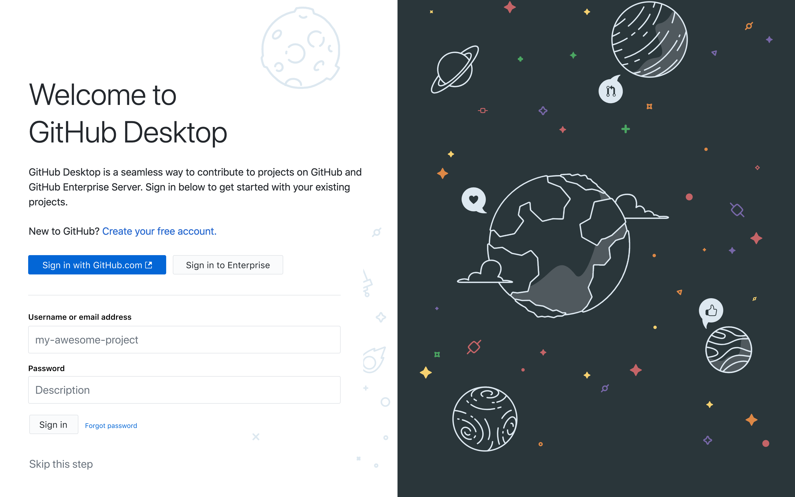

# *control de versiones*
En este recorrido repasaremos los conceptos básicos de de control de versiones utilizando [Git](https://git-scm.com/downloads) y [GitHub](https://github.com/). 

# [PASOS PREVIOS] Guias de Procedimiento 
Para resolver este TP vas a necesitar: 
        a) Create un usuario en  [GitHub](https://github.com/)
        b) Instalarte la versión de escritorio de [GitHub desktop](https://desktop.github.com/)
        c) Ahora vamos a vincular tu usuario de de GitHub con tu aplicación de escritorio. Para ello tendras que abrir la aplicación de escritorio y logearte en GitHub desde allí, utilizando el botón 

        

## Ejercitación