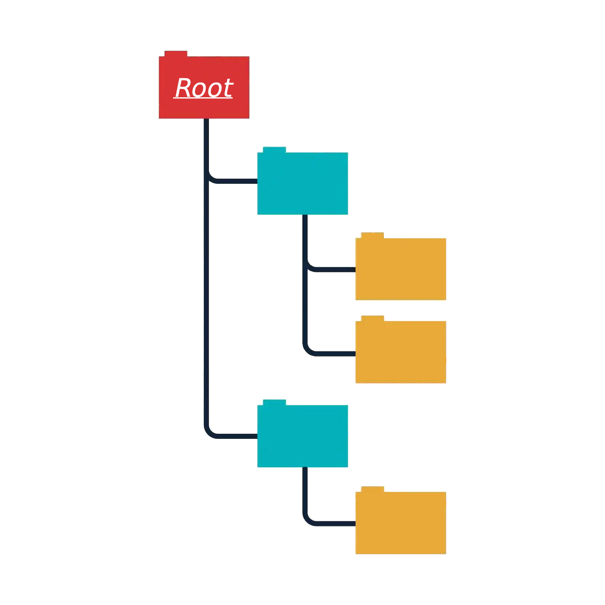

## Rutas, os, glob

[Rutas, absolutas y relativas](rutas)



La ruta absoluta representa la ruta completa del archivo o carpeta, desde el directorio raíz hasta llegar al archivo o carpeta en concreto que estamos buscando. Por su parte, la ruta relativa representa solo una parte de la ruta, ya que en ella se tiene en cuenta el directorio actual desde el que estamos trabajando.
Por cuestiones de seguridad y comodidad muchas veces es recomendable trabajar con rutas relativas ya que de esta manera solo son movemos dentro de las carpetas correspondientes y no hay peligro de poder acceder a otra carpeta y modificar cosas que no deberíamos, siendo, tal vez, el mayor "inconveniente" saber en qué carpeta estamos parados, para saber para dónde hay que moverse.
Dos caracteres especiales que se utilizan en las rutas son:

- el punto, `.`, que indica la carpeta en la que estamos parados;
- y los dos puntos, `..`, que indica la carpeta superior.

[os, os.listdir y glob](glob)

La biblioteca `os` tiene muchos métodos útiles para todo lo que se refiere a rutas, creación y eliminación de carpetas, modificación de archivos, etc.
Dos métodos muy importantes son:

- `os.mkdir(ruta)`, el cual sirve para crear una carpeta en la ruta indicada (si queremos crearla en la carpeta donde estamos parados solo tenemos que poner el nombre de la carpeta).
- `os.chdir(ruta)`, el cual nos permite movernos de carpeta hasta la ruta indicada.

Ejemplos de estos pueden ser:

```python
# crear la carpeta Prácticas en el directorio actual:
os.mkdir("Prácticas")

# crear la carpeta Teorías en el directorio superior:
os.mkdir("../Teorías")

# movernos a la carpeta Prácticas:
os.chdir("Prácticas")

# movernos desde Prácticas a Teorías
os.chdir("../../Teorías")
```

Algo que resulta muy útil es poder acceder a los archivos que hayan en una determinada carpeta sin conocer sus nombres en particular, o acceder a un grupo de estos archivos que tengan algo en común (que todos tengan la misma extensión por ejemplo), más aún si son archivos que el programa genera en su ejecución, de manera de que a priori no los tenemos. Para esto podemos usar dos herramientas, el método `listdir` de la biblioteca `os` y el método `glob` de la biblioteca `glob`. Con el primero obtenemos una lista de todos los archivos que se encuentran en una carpeta, mientras que con el segundo, además de esto, tenemos la posibilidad de listar archivos específicos. Es decir:

```python
>>> import os
>>> import glob
>>> os.listdir()
['Ej1.py', 'Ej3.py', 'archivo2.txt', 'Ej2.py', 'Ej4.py', 'documento.txt', 'Ej5.py'...]
>>> glob.glob("*")
['Ej1.py', 'Ej3.py', 'archivo2.txt', 'Ej2.py', 'Ej4.py', 'documento.txt', 'Ej5.py'...]
>>> glob.glob("*.py")
['Ej1.py', 'Ej3.py', 'Ej2.py', 'Ej4.py', 'Ej5.py'...]
```

Como ven, podemos obtener una lista, la cual podríamos recorrer tanto para todos los archivos de una carpeta como para los archivos específicos.


## Ejercicio de práctica
Escribir un script en el cual debemos movernos a la carpeta **Informes** y obtener los archivos *.txt que hayan allí. Por cada archivo hay que obtener, por un lado, cuántas veces aparece la palabra "estado" y por otro lado la cantidad de líneas. Por último, hay que crear una carpeta que se llame Apellidos, donde hay que crear un archivo llamado **Lista.txt** que contenga en cada línea la primer línea de cada archivo .txt obtenidos anteriormente.
