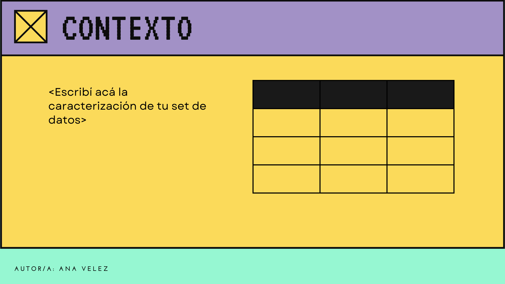
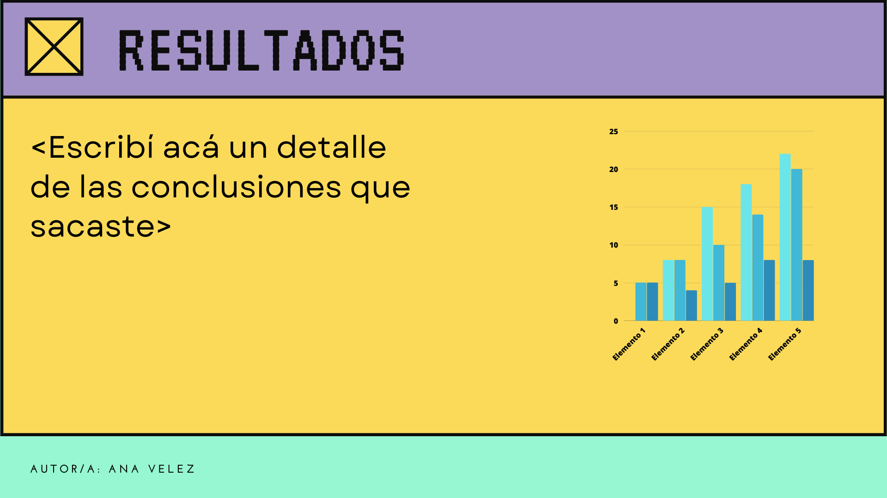
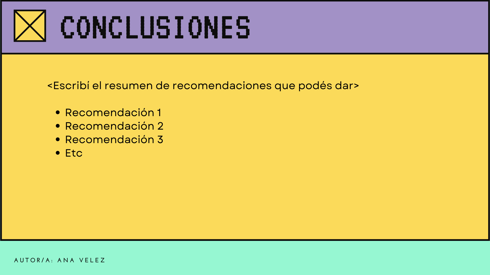

### Ejercicio

Realizar una aplicación donde en su home se muestren los datos que tienen que analizar

Esta aplicación expondrá también un end-point `resultados` que mostrará los resultados de los análisis realizados sobre los datos

Y por último expondrá un end-point `plan_2023` que mostrará las conclusiones de estos análisis y los planes de acción 2023

