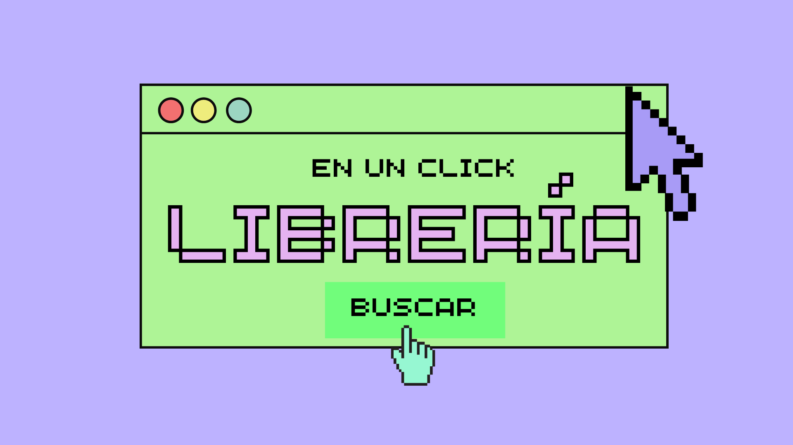
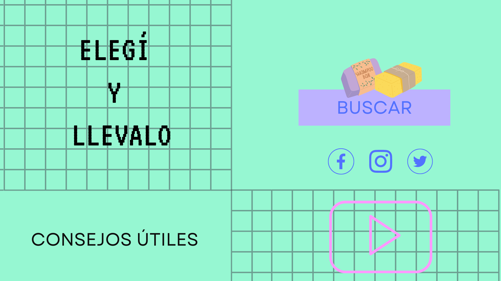

# [Practica] *REQUESTS*

🚨 Este material fue creado por la Dra. Ana Julia Velez Rueda y como todo el repositorio se encuentra bajo licencia 
[Creative Commons Attribution-ShareAlike 4.0 International License][cc-by-sa].

[![CC BY-SA 4.0][cc-by-sa-image]][cc-by-sa]

[cc-by-sa]: http://creativecommons.org/licenses/by-sa/4.0/
[cc-by-sa-image]: https://licensebuttons.net/l/by-sa/4.0/88x31.png
[cc-by-sa-shield]: https://img.shields.io/badge/License-CC%20BY--SA%204.0-lightgrey.svg


> En esta ejercitación se basa en el recorrido teórico de [Web y Flask](https://github.com/AJVelezRueda/Macowins_En_Flask), si no lo leíste aún te recomiendo hacerlo antes de comenzar.

<details>
  <summary>🚨 REQUERIMIENTOS</summary>

En este abordaremos los contenidos relativos a HTTP y REST. Para ello vas a necesitar instalarte [requests] (https://pypi.org/project/requests/):

```bash
pip install requests
```


Primero puedes verificar si está o no instalado escribiendo en la consola de Python:
```python
import requests
```

 Una vez que hayas completado el recorrido de HTTP podés continuar con este recorrido 👇
</details>

En general un servidor Web provee varios contenidos diferentes, es por ello que existen las URLs. Estas nos permiten identificar y localizar de forma unívoca un recurso, y dentro del servidor, encontraremos en distintas URLs relativas al mismo. 

En general el diseño de estas URLs se hace tal que cada ruta apunta a un recurso bien definido. La semántica de cada ruta está dada en parte por el sentido propio en el contexto de ese dado dominio, pero también por el método HTTP que se utilice. 

Ejemplos:

    - /productos/45: si se usa GET, se devuelve el producto con id 45. Si se usa DELETE, se lo borra. 

    - /productos: si se usa GET devuelve todos los productos, si se usa PUT, se los actualiza en lote

    - /productos/45/ventasRecientes: si se usa GET, devuelve todas las ventas recientes del producto con id 45


**🧗‍♀️ Desafío I**: Estamos construyendo una aplicación Web para un biblioteca, en la cuál podrá:

- consultar y cargar o borrar información sobre libros

- consultar y cargar o borrar revistas y audio libros disponibles

a) Escribí las posibles rutas indicando sus métodos HTTP correspondientes.

b) Maquetá el home de de la aplicación utilizando todo lo aprendido de HTML y css, siguiendo la referencia de la imagen siguiente:



> [Notas]: aunque no debe ser una réplica exácta, podés encontrar material útil en la carpeta `recursos` y te pueden ser útiles los siguientes datos: 
>
> - Paleta de colores: verde opaco (#aef496); Violeta (#bdb2ff); verde brillante (#71fd7b); rojo (#f27070) y amarillo (#eeec7c). 
> - Font family: Arcade gamer
>


**🧗‍♀️ Desafío II**: Estamos construyendo una aplicación para un e-comerce de venta de productos cosméticos naturales. La aplicación debe permitir:

 1- Buscar todos los productos
 
 2- Buscar los productos por número
 
 3- Editar la información de los productos
 
 4- Eliminar la información de los productos

a) Escribí las posibles rutas indicando sus métodos HTTP correspondientes.

b) Desarrollá una api en Flask que permita consultar sobre las rutas 1 y 2, teniendo en cuenta las siguientes características:
  
  + La información sobre los productos deben estar almacenados en un DataFrame con la siguiente estructura:


| Producto | Stock | Precio_unitario |
|-------------	|----------	|---	|
| Shampoo sólido | 5 | 300 |
| Crema de manos | 6 | 600 |

  + En el root `/` de la aplicación devuelve un html con el siguiente estilo:

  

  > [Notas]: aunque no debe ser una réplica exácta, podés encontrar material útil en la carpeta `recursos` y te pueden ser útiles los siguientes datos: 
  >
  > - Paleta de colores: verde (#96f7d2); Rosa (#ff99ff); violeta (#bdb2ff) y azul (#5271ff). 
  > - Font family: Garet y VT323
  >
  
  + En la ruta para obtener la información de los `productos` devuelve un html con el DataFrame

  + El la ruta para acceder a cada producto la api debe soportar la modificación del producto

